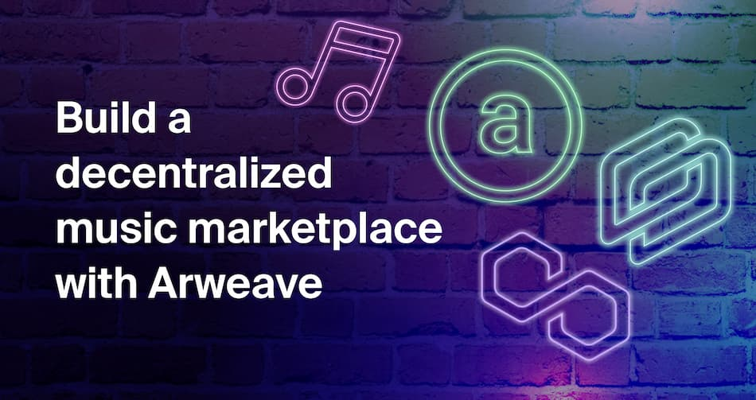

<p align="center"></p>

# Decentralized music marketplace

This repository contains the code neccessary to run a decentralized music marketplace app.

- Users will be able to upload MP3 files and list them for sale by a price.
- The songs will be uploaded to Arweave via Bundlr. The song's metadata (title, price, author and download link) will be stored in a smart contract (in my case, deployed in Polygon).
- Other users will bee able to browse listed songs and buy them.
- When a user buys a song, the tokens will be sent to the author and the buyer will be able to retrieve the download link from the contract.

I've limited this app to MP3 files. In addition, the songs will be bought and sold using MATIC only, but you can extend this app to work with other file types and multiple protocols if you want. In that case, you'd need to adapt the currencies accepted by Budnlr and deploy the contract to multiple protocols 😉

If you need some help with this, feel free to [contact me on Twitter @uF4No](https://twitter.com/uF4No)

## Tech stack

Built with React (Next.js), TailwindCSS, Arweave + Bundlr and Solidity smart contracts.

### Smart contract

This app uses a smart contract deployed in Polygon. This contract holds the metadata of the songs listed to sell and allows users to buy them.

To compile and run the contract's tests run `npm run test`. The compiled contract artifacts will be generated on the `/artifacts` folder (included in the build).

### Front end

This app is a [Next.js](https://nextjs.org/) project bootstrapped with [`create-next-app`](https://github.com/vercel/next.js/tree/canary/packages/create-next-app).

First, install all dependencies with `npm i` and run the development server:

```bash
npm run dev
# or
yarn dev
```

Open [http://localhost:3000](http://localhost:3000) with your browser to see the result.

### Environment variables

You'd need two different environment files:

- `.env`: used to load the wallet private key and RPC endpoints. These are required to deploy the smart contracts using the deploy scripts defined in the `package.json file`.
- `.env.local`: used to load the required variables for the front end application: smart contract address, target network in hex format and bundlr endpoint

Use the `.env.example` and `.env.local.example` as reference.

## Run it locally

0. Clone this repo (and give it a start 🌟)
1. Install all dependencies with `npm i`.
2. Compile and run the smart contract tests with `npm run test`.
3. In a separate terminal, start a local node with `npx hardhat node`.
4. Import in Metamask some of the wallet addresses provided in the local node terminal window
5. Deploy the contract to your local node with `npm run deploy:local`. Save the contract deployed address for next step.
6. Rename `env.local.example` to `.env.local` and enter the contract address in the `NEXT_PUBLIC_CONTRACT_ADDRESS` variable.
7. Start the web application with `npm run dev`.
8. Open your browser and visit `http://localhost:3000`

## Run it in testnet / mainnet

You can deploy the contracts to Mumbai testnet or Polygon mainnet with `npm run deploy:test` or `npm run deploy:prod`. Make sure to adapt the environment variables as mentioned above.

You can run the web app pointing to the contract deployed in testnet/mainnet following the instructions above, you just need to adapt the environment variables in the `.env.local` file.

You can also deploy the web application Vercel or Netlify.
